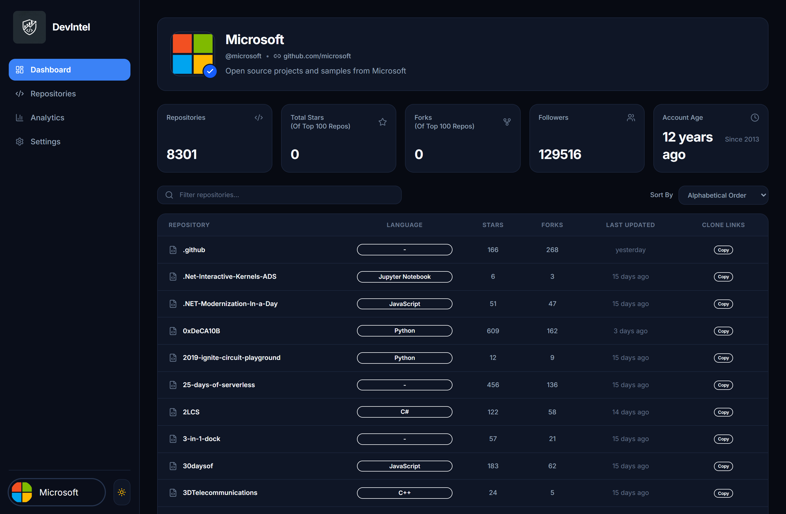
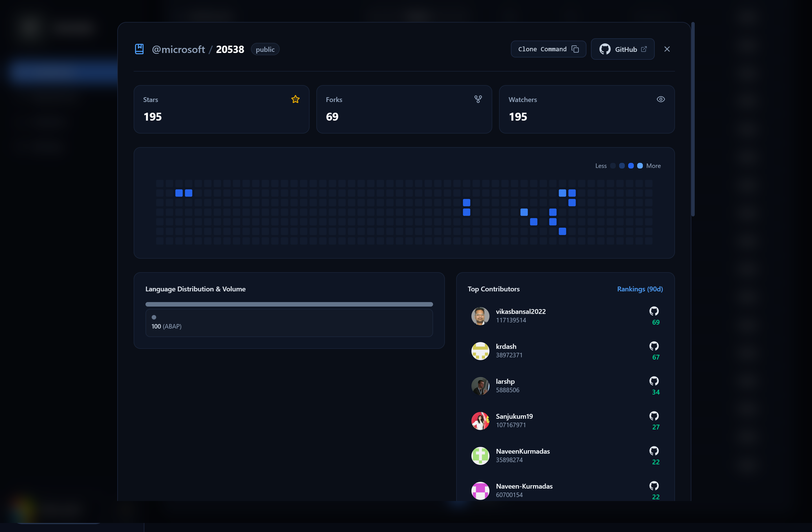
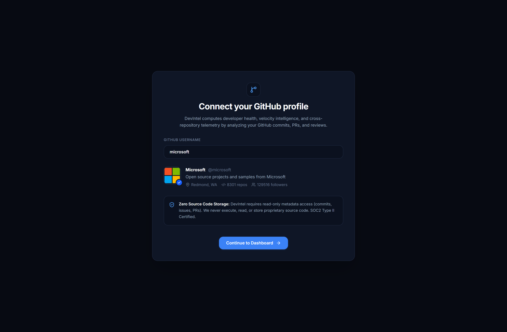
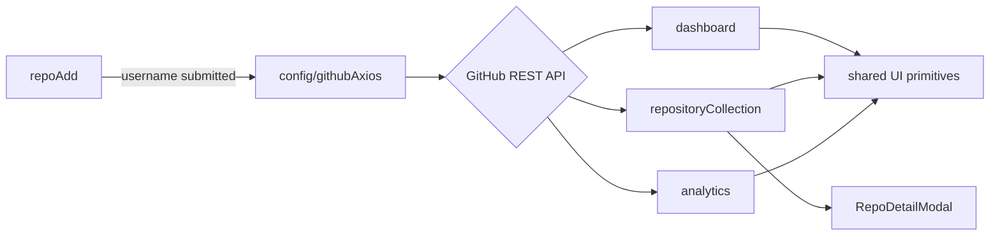

```
 ____  _______     _____       _       _ 
|  _ \| ____\ \   / /_ _|_ __ | |_ ___| |
| | | |  _|  \ \ / / | || '_ \| __/ _ \ |
| |_| | |___  \ V /  | || | | | ||  __/ |
|____/|_____|  \_/  |___|_| |_|\__\___|_|

        engineering telemetry, minus the guesswork
```

<div align="center">

**A cross-repository developer intelligence platform built on the GitHub REST API.**
Commit heatmaps, language footprints, contributor velocity — in one dashboard instead of ten browser tabs.

[](https://react.dev)
[](https://vitejs.dev)
[](https://tailwindcss.com)
[](https://redux-toolkit.js.org)
[](#license)

<div align="center">

[](https://dev-intel-eight.vercel.app/)

</div>
</div>

---

### 📸 See it in action


| Dashboard Overview | Repo Detail Modal | SignUp Overview |
|---|---|---|
|  |  |  |

<strong>🎬 30-second walkthrough</strong><br>
.gif)

---

## Why I built this

I wanted a single screen that answers "is this codebase actually healthy?" without ten GitHub tabs open — commit cadence, language spread, who's actually shipping. That's DEVIntel: point it at a GitHub username, get a 52-week activity matrix, language distribution, and contributor rankings back.

It's also where I taught myself Feature-Sliced Architecture properly, instead of just reading about it.

## What it does

- **52-week commit activity matrix** — GitHub's own contribution-graph math, rebuilt client-side
- **Language distribution** — raw byte counts converted into readable proportions per repo
- **Contributor velocity rankings** — who's actually pushing commits, not just who's listed
- **Cross-repo dashboard** — filter, sort, and inspect without leaving the page
- **Light/dark theme** — CSS-variable driven, zero JS runtime cost on toggle

## Tech stack

| Layer | Choice | Why |
|---|---|---|
| UI | React 19 + Vite 7 | sub-second HMR, builds in under 3s |
| Styling | Tailwind v4 (`@theme`) | CSS-variable tokens, instant theme switching |
| State | Redux Toolkit | only for persistent identity — not a dumping ground for UI state |
| Data | GitHub REST API via Axios | centralized instance, one place for auth headers and base URLs |
| Routing | React Router v8 | nested layouts, `<Outlet />` for shells |

## Architecture

Structured as Feature-Sliced Architecture — every domain owns its own `api/`, `hooks/`, `ui/`, and `state/`. No shared god-components, no logic buried inside JSX.



<strong>Folder structure</strong>

```
src/
├── app/            # store, routing, layout shells
├── config/         # githubAxios, env bindings
├── features/
│   ├── analytics/
│   ├── dashboard/
│   ├── repoAdd/
│   ├── repositoryCollection/
│   └── settings/
├── shared/
└── index.css        # Tailwind v4 design tokens
```

## The hard parts (and what I learned solving them)

**Infinite re-render loops.** My first data hooks triggered network cascades because I was watching `[repos]` instead of `[user?.login]` in `useEffect`. Cost me a night; taught me how reference equality actually works in React.

**GitHub's async stats pipeline.** `/stats/commit_activity` kept returning `{}` or a bare `202` — turns out GitHub computes those stats on demand in the background. Fixed it with a polling/retry loop instead of assuming the request had failed.

**Bytes into a heatmap.** Language stats come back as raw byte counts, commit activity as week-indexed arrays — neither maps directly to a chart. I ended up building a quantile-bucketing pass (levels 0–4) to approximate GitHub's own contribution-graph contrast.

## Known rough edges

Being upfront about this — it's a learning project, not a finished product:

- Modal state isn't URL-driven yet, so opening a repo detail doesn't survive the back button (fix: move `selectedRepo` into a query param)
- No client-side caching — reopening a repo re-fetches from scratch, which burns API quota fast on the unauthenticated 60 req/hr limit
- A few API handlers swallow errors into `undefined` instead of returning a structured `{ error, data }` shape

## Roadmap

- [ ] TanStack Query for caching, dedup, and background refetch
- [ ] Virtualized rendering (`@tanstack/react-virtual`) for accounts with hundreds of repos
- [ ] Real GitHub OAuth flow instead of a `.env` personal access token
- [ ] Exportable SVG/PDF "engineering health cards" for embedding in other READMEs

## Getting started

```bash
git clone https://github.com/<your-username>/devintel.git
cd devintel
npm install
cp .env.example .env   # add your GitHub PAT to raise the rate limit to 5,000 req/hr
npm run dev
```

## License

MIT — use it, fork it, tell me what's broken.

---

## 👤 About

**Raj Shah** - Full Stack Web Developer

🎓 Nirma University | 📍 Ahmedabad, India

[](https://github.com/rajshahdev966)
[](https://www.linkedin.com/in/rajshah-dev/)

